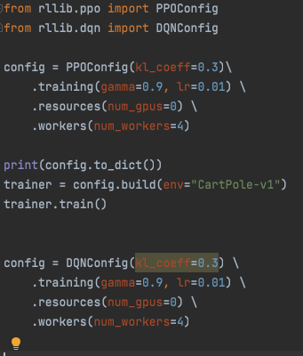

RLlib Configuration
===================

Link to GitHub project:  `maxpumperla/rllib-trainer <https://github.com/maxpumperla/rllib-trainer>`_

.. contents::
    :local:
    :depth: 1

Defining a trainer
------------------

Here's how you define and run a PPO Trainer, with and without Tune:

.. code-block:: python

    from ray import tune
    from rllib.ppo import PPOConfig

    config = PPOConfig(kl_coeff=0.3) \
        .training(gamma=0.9, lr=0.01) \
        .resources(num_gpus=0) \
        .workers(num_workers=4)

    print(config.to_dict())
    trainer = config.build(env="CartPole-v1")
    trainer.train()

    config_dict = trainer.get_config()
    config_dict.update({
        "lr": tune.grid_search([0.01, 0.001, 0.0001]),
    })

    tune.run(
        "PPO",
        stop={"episode_reward_mean": 200},
        config=config_dict
    )

If you define a DQN Trainer with the wrong config, your IDE will tell you on definition:

.. code-block:: python

    from rllib.dqn import DQNConfig

    # "kl_coeff" is not defined in DQNConfig, your IDE will bark at you.
    config = DQNConfig(kl_coeff=0.3) \
        .training(gamma=0.9, lr=0.01) \
        .resources(num_gpus=0) \
        .workers(num_workers=4)

Here's a snapshot from PyCharm:

How to document Trainers in a less annoying way
-----------------------------------------------

Instead of having loooooooong lists of flat parameters, we can simply auto-generate
class documentation, with types and stuff.
Users might actually understand what's going on!

TrainerConfigurator
-------------------

.. autoclass:: rllib.trainer.TrainerConfig
    :members:
    :show-inheritance:

PPO
---

.. autoclass:: rllib.ppo.PPOConfig
    :members:
    :show-inheritance:

DQN
---

.. autoclass:: rllib.dqn.DQNConfig
    :members:
    :show-inheritance:
